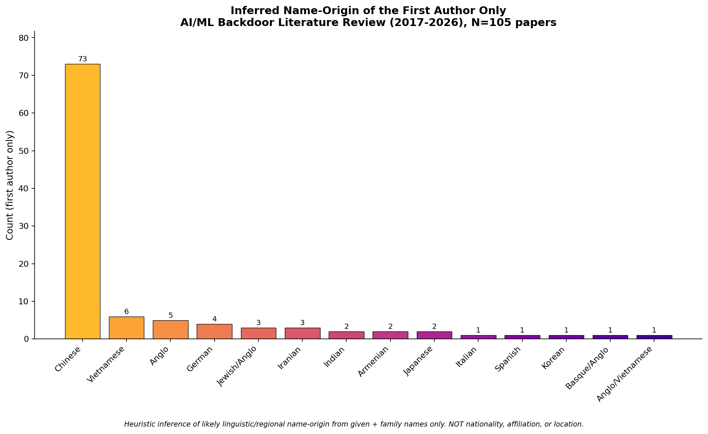

# Backdoors in AI/ML (2017–2026): A State-of-the-Art Literature Review

> Scope: data-poisoning/trigger attacks, federated learning, LLMs, cryptographic/architectural backdoors, generative/graph/SSL settings, and defenses (empirical + certified). ~105 papers, weighted to 2022–2026.

## Table of contents

1. [Introduction](#1-introduction)
2. [Taxonomy](#2-taxonomy)
3. [Paper catalog by theme](#3-paper-catalog-by-theme)
4. [Inferred name-origin of authors](#4-inferred-name-origin-of-authors)
5. [Trends & open problems](#5-trends--open-problems)
6. [Recommendations](#6-recommendations)
7. [Full reference list](#7-full-reference-list)

## 1. Introduction

A **backdoor** (neural trojan) is a hidden behaviour implanted in a model so it performs normally on ordinary inputs but produces an attacker-chosen output whenever a secret **trigger** is present. The canonical demonstration, [BadNets (2017)](https://arxiv.org/abs/1708.06733), trained a traffic-sign classifier that misclassified >90% of stop signs as speed-limit signs once a sticker was applied, while clean accuracy dropped <1%. That combination — full utility on clean data plus near-total control on triggered data — is what makes backdoors uniquely dangerous and hard to detect.

Over 2022–2026 the threat moved far beyond image classification into federated learning, large language models and their instruction-tuning/RLHF pipelines, self-supervised encoders, diffusion and text-to-image generators, graph neural networks, and reinforcement learning. A separate line showed backdoors need not be inserted via poisoned data at all: they can be planted in weights, baked into architecture, or made provably undetectable under cryptographic assumptions.

## 2. Taxonomy

Backdoor work is best located along four largely independent dimensions:

- **Injection stage** — data poisoning; weight/parameter modification (handcrafted); architectural; inference/prompt-time (LLMs).
- **Trigger type** — patch/blended; sample-specific & warping (ISSBA, WaNet); frequency-domain (FTrojan, FIBA); semantic/syntactic (text style, syntax templates).
- **Label strategy** — dirty-label (effective but conspicuous) vs. clean-label (Clean-Label, Hidden Trigger, Narcissus, Sleeper Agent).
- **Paradigm/modality** — vision, NLP/LLMs, federated learning, SSL/contrastive, diffusion/generative, GNNs, RL, multimodal.

## 3. Paper catalog by theme

Each table lists the first two authors, year, venue, and a verified link where available (🔗 = independently verified URL).

### Surveys & Taxonomy

| # | Paper | First author | Second author | Year | Venue |
|---|---|---|---|---|---|
| 1 | 🔗 [Backdoor Learning: A Survey](https://www.researchgate.net/publication/343006441_Backdoor_Learning_A_Survey) | Yiming Li | Yong Jiang | 2022 | IEEE TNNLS |
| 2 | 🔗 [Backdoor Attacks and Countermeasures on Deep Learning: A Comprehensive Review](https://arxiv.org/abs/2007.10760) | Yansong Gao | Bao Gia Doan | 2020 | arXiv |
| 3 | 🔗 [Data Security for ML: Data Poisoning, Backdoor Attacks, and Defenses](https://arxiv.org/abs/2012.10544) | Micah Goldblum | Dimitris Tsipras | 2022 | IEEE TPAMI |
| 4 | 🔗 [A Comprehensive Survey on Poisoning Attacks and Countermeasures in ML](https://dl.acm.org/doi/10.1145/3551636) | Zhiyi Tian | Lei Cui | 2022 | ACM Computing Surveys |
| 5 | Backdoor Attacks and Defenses in Federated Learning: Survey, Challenges and Future Directions | Thuy Dung Nguyen | Tuan Anh Nguyen | 2024 | Eng. Appl. of AI |
| 6 | 🔗 [A Survey of Neural Trojan Attacks and Defenses in Deep Learning](https://arxiv.org/abs/2202.07183) | Jie Wang | Ghulam Mubashar Hassan | 2022 | arXiv |
| 7 | 🔗 [Threats to Pre-trained Language Models: Survey and Taxonomy](https://arxiv.org/abs/2202.06862) | Shangwei Guo | Chunlong Xie | 2022 | arXiv |
| 8 | Defenses in Adversarial Machine Learning: A Survey | Baoyuan Wu | Shaokui Wei | 2023 | arXiv |

### Data-poisoning / Trigger-based Attacks (Computer Vision)

| # | Paper | First author | Second author | Year | Venue |
|---|---|---|---|---|---|
| 9 | 🔗 [BadNets: Evaluating Backdooring Attacks on Deep Neural Networks](https://arxiv.org/abs/1708.06733) | Tianyu Gu | Kang Liu | 2019 | IEEE Access |
| 10 | 🔗 [Targeted Backdoor Attacks on Deep Learning Systems Using Data Poisoning (Blended)](https://arxiv.org/abs/1712.05526) | Xinyun Chen | Chang Liu | 2017 | arXiv |
| 11 | 🔗 [Trojaning Attack on Neural Networks](https://docs.lib.purdue.edu/cgi/viewcontent.cgi?article=2782&context=cstech) | Yingqi Liu | Shiqing Ma | 2018 | NDSS |
| 12 | 🔗 [A New Backdoor Attack in CNNs by Training Set Corruption Without Label Poisoning (SIG)](https://arxiv.org/abs/1902.11237) | Mauro Barni | Kassem Kallas | 2019 | IEEE ICIP |
| 13 | 🔗 [Clean-Label Backdoor Attacks](https://arxiv.org/abs/1912.02771) | Alexander Turner | Dimitris Tsipras | 2019 | Tech report (MIT) |
| 14 | Hidden Trigger Backdoor Attacks | Aniruddha Saha | Akshayvarun Subramanya | 2020 | AAAI |
| 15 | 🔗 [Input-Aware Dynamic Backdoor Attack](https://arxiv.org/abs/2010.08138) | Tuan Anh Nguyen | Anh Tran | 2020 | NeurIPS |
| 16 | 🔗 [WaNet: Imperceptible Warping-based Backdoor Attack](https://openreview.net/forum?id=eEn8KTtJOx) | Tuan Anh Nguyen | Anh Tuan Tran | 2021 | ICLR |
| 17 | 🔗 [Invisible Backdoor Attack with Sample-Specific Triggers (ISSBA)](https://arxiv.org/abs/2012.03816) | Yuezun Li | Yiming Li | 2021 | ICCV |
| 18 | 🔗 [Reflection Backdoor (Refool)](https://arxiv.org/abs/2007.02343) | Yunfei Liu | Xingjun Ma | 2020 | ECCV |
| 19 | 🔗 [LIRA: Learnable, Imperceptible and Robust Backdoor Attacks](https://openaccess.thecvf.com/content/ICCV2021/papers/Doan_LIRA_Learnable_Imperceptible_and_Robust_Backdoor_Attacks_ICCV_2021_paper.pdf) | Khoa Doan | Yingjie Lao | 2021 | ICCV |
| 20 | 🔗 [An Invisible Black-Box Backdoor Attack Through Frequency Domain (FTrojan)](https://www.ecva.net/papers/eccv_2022/papers_ECCV/papers/136730396.pdf) | Tong Wang | Yuan Yao | 2022 | ECCV |
| 21 | 🔗 [FIBA: Frequency-Injection Based Backdoor Attack in Medical Image Analysis](https://pure.nwpu.edu.cn/en/publications/fiba-frequency-injection-based-backdoor-attack-in-medical-image-a/) | Yu Feng | Benteng Ma | 2022 | CVPR |
| 22 | 🔗 [BppAttack: Stealthy and Efficient Trojan Attacks via Image Quantization](https://arxiv.org/abs/2205.13383) | Zhenting Wang | Juan Zhai | 2022 | CVPR |
| 23 | 🔗 [DEFEAT: Deep Hidden Feature Backdoor Attacks](https://openaccess.thecvf.com/content/CVPR2022/papers/Zhao_DEFEAT_Deep_Hidden_Feature_Backdoor_Attacks_by_Imperceptible_Perturbation_and_CVPR_2022_paper.pdf) | Zhendong Zhao | Xiaojun Chen | 2022 | CVPR |
| 24 | 🔗 [Sleeper Agent: Scalable Hidden Trigger Backdoors for NNs Trained from Scratch](https://arxiv.org/abs/2106.08970) | Hossein Souri | Liam Fowl | 2022 | NeurIPS |
| 25 | 🔗 [Narcissus: A Practical Clean-Label Backdoor Attack with Limited Information](https://arxiv.org/abs/2204.05255) | Yi Zeng | Minzhou Pan | 2023 | ACM CCS |
| 26 | Towards Sample-specific Backdoor Attack with Clean Labels via Attribute Trigger | Mingyan Zhu | Yiming Li | 2024 | IEEE TDSC |
| 27 | 🔗 [WaveAttack: Asymmetric Frequency Obfuscation-based Backdoor Attacks](https://proceedings.neurips.cc/paper_files/paper/2024/file/4ce18228ececb78bca04cbce069891b1-Paper-Conference.pdf) | Jun Xia | Zhihao Yue | 2024 | NeurIPS |
| 28 | Physical Backdoor: Temperature-based Backdoor Attacks in the Physical World | Wen Yin | Jian Lou | 2024 | CVPR |
| 29 | 🔗 [Backdoor Attacks Against Deep Learning Systems in the Physical World](https://arxiv.org/abs/2006.14580) | Emily Wenger | Josephine Passananti | 2021 | CVPR |

### Federated & Distributed Learning

| # | Paper | First author | Second author | Year | Venue |
|---|---|---|---|---|---|
| 30 | How to Backdoor Federated Learning | Eugene Bagdasaryan | Andreas Veit | 2020 | AISTATS |
| 31 | 🔗 [DBA: Distributed Backdoor Attacks Against Federated Learning](https://openreview.net/pdf/61dc789b9f12be96506a23ddb7670ac132a51d6d.pdf) | Chulin Xie | Keli Huang | 2020 | ICLR |
| 32 | Attack of the Tails: Yes, You Really Can Backdoor Federated Learning | Hongyi Wang | Kartik Sreenivasan | 2020 | NeurIPS |
| 33 | Neurotoxin: Durable Backdoors in Federated Learning | Zhengming Zhang | Ashwinee Panda | 2022 | ICML |
| 34 | A3FL: Adversarially Adaptive Backdoor Attacks to Federated Learning | Hangfan Zhang | Jinyuan Jia | 2023 | NeurIPS |
| 35 | IBA: Towards Irreversible Backdoor Attacks in Federated Learning | Thuy Dung Nguyen | Tuan Anh Nguyen | 2023 | NeurIPS |
| 36 | Chameleon: Adapting to Peer Images for Planting Durable Backdoors in FL | Yanbo Dai | Songze Li | 2023 | ICML |
| 37 | FLAME: Taming Backdoors in Federated Learning | Thien Duc Nguyen | Phillip Rieger | 2022 | USENIX Security |
| 38 | DeepSight: Mitigating Backdoor Attacks in FL Through Deep Model Inspection | Phillip Rieger | Thien Duc Nguyen | 2022 | NDSS |
| 39 | FLDetector: Defending FL Against Model Poisoning via Detecting Malicious Clients | Zaixi Zhang | Xiaoyu Cao | 2022 | ACM SIGKDD |
| 40 | CrowdGuard: Federated Backdoor Detection in Federated Learning | Phillip Rieger | Torsten Krauss | 2024 | NDSS |
| 41 | BackdoorIndicator: Leveraging OOD Data for Proactive Backdoor Detection in FL | Songze Li | Yanbo Dai | 2024 | USENIX Security |
| 42 | Distributed Backdoor Attacks on Federated Graph Learning and Certified Defenses | Yuxin Yang | Qiang Li | 2024 | ACM CCS |

### LLMs, Instruction Tuning, RLHF, In-Context, Code

| # | Paper | First author | Second author | Year | Venue |
|---|---|---|---|---|---|
| 43 | 🔗 [Instructions as Backdoors: Backdoor Vulnerabilities of Instruction Tuning for LLMs](https://arxiv.org/abs/2305.14710) | Jiashu Xu | Mingyu Derek Ma | 2024 | NAACL |
| 44 | Backdooring Instruction-Tuned LLMs with Virtual Prompt Injection | Jun Yan | Vikas Yadav | 2024 | NAACL |
| 45 | 🔗 [Sleeper Agents: Training Deceptive LLMs that Persist Through Safety Training](https://arxiv.org/abs/2401.05566) | Evan Hubinger | Carson Denison | 2024 | arXiv (Anthropic) |
| 46 | Universal Jailbreak Backdoors from Poisoned Human Feedback | Javier Rando | Florian Tramer | 2024 | ICLR |
| 47 | 🔗 [RLHFPoison: Reward Poisoning Attack for RLHF in Large Language Models](https://arxiv.org/abs/2311.09641) | Jiongxiao Wang | Junlin Wu | 2024 | ACL |
| 48 | Preference Poisoning Attacks on Reward Model Learning | Junlin Wu | Jiongxiao Wang | 2024 | arXiv |
| 49 | PoisonBench: Assessing LLM Vulnerability to Data Poisoning | Tingchen Fu | Mrinank Sharma | 2024 | arXiv |
| 50 | 🔗 [Instruction Backdoor Attacks Against Customized LLMs](https://www.usenix.org/system/files/usenixsecurity24-zhang-rui.pdf) | Rui Zhang | Hongwei Li | 2024 | USENIX Security |
| 51 | Weight Poisoning Attacks on Pre-trained Models | Keita Kurita | Paul Michel | 2020 | ACL |
| 52 | BadNL: Backdoor Attacks Against NLP Models with Semantic-preserving Improvements | Xiaoyi Chen | Ahmed Salem | 2021 | ACSAC |
| 53 | Hidden Killer: Invisible Textual Backdoor Attacks with Syntactic Trigger | Fanchao Qi | Mukai Li | 2021 | ACL/IJCNLP |
| 54 | Mind the Style of Text! Backdoor Attacks Based on Text Style Transfer | Fanchao Qi | Yangyi Chen | 2021 | EMNLP |
| 55 | Turn the Combination Lock: Learnable Textual Backdoor Attacks via Word Substitution | Fanchao Qi | Yuan Yao | 2021 | ACL/IJCNLP |
| 56 | ONION: A Simple and Effective Defense Against Textual Backdoor Attacks | Fanchao Qi | Yangyi Chen | 2021 | EMNLP |
| 57 | Concealed Data Poisoning Attacks on NLP Models | Eric Wallace | Tony Zhao | 2021 | NAACL |
| 58 | Hidden Trigger Backdoor Attack on NLP Models via Linguistic Style Manipulation | Xudong Pan | Mi Zhang | 2022 | USENIX Security |
| 59 | TrojanPuzzle: Covertly Poisoning Code-Suggestion Models | Hojjat Aghakhani | Wei Dai | 2024 | IEEE S&P |

### Cryptographic / Weight-level / Architectural / Supply-chain

| # | Paper | First author | Second author | Year | Venue |
|---|---|---|---|---|---|
| 60 | 🔗 [Planting Undetectable Backdoors in Machine Learning Models](https://arxiv.org/abs/2204.06974) | Shafi Goldwasser | Michael Kim | 2022 | FOCS |
| 61 | 🔗 [Handcrafted Backdoors in Deep Neural Networks](https://openreview.net/forum?id=6yuil2_tn9a) | Sanghyun Hong | Nicholas Carlini | 2022 | NeurIPS |
| 62 | 🔗 [Architectural Backdoors in Neural Networks](https://arxiv.org/abs/2206.07840) | Mikel Bober-Irizar | Ilia Shumailov | 2023 | CVPR |
| 63 | Architectural Neural Backdoors from First Principles | Harry Langford | Ilia Shumailov | 2025 | IEEE S&P |
| 64 | 🔗 [Blind Backdoors in Deep Learning Models](https://arxiv.org/abs/2005.03823) | Eugene Bagdasaryan | Vitaly Shmatikov | 2021 | USENIX Security |
| 65 | 🔗 [Can Adversarial Weight Perturbations Inject Neural Backdoors](https://arxiv.org/abs/2008.01761) | Siddhant Garg | Adarsh Kumar | 2020 | CIKM |

### SSL / Diffusion / GNN / Multimodal

| # | Paper | First author | Second author | Year | Venue |
|---|---|---|---|---|---|
| 66 | BadEncoder: Backdoor Attacks to Pre-trained Encoders in Self-Supervised Learning | Jinyuan Jia | Yupei Liu | 2022 | IEEE S&P |
| 67 | An Embarrassingly Simple Backdoor Attack on Self-Supervised Learning | Changjiang Li | Ren Pang | 2023 | ICCV |
| 68 | BadDiffusion: How to Backdoor Diffusion Models? | Sheng-Yen Chou | Pin-Yu Chen | 2023 | CVPR |
| 69 | TrojDiff: Trojan Attacks on Diffusion Models with Diverse Targets | Weixin Chen | Dawn Song | 2023 | CVPR |
| 70 | VillanDiffusion: A Unified Backdoor Attack Framework for Diffusion Models | Sheng-Yen Chou | Pin-Yu Chen | 2023 | NeurIPS |
| 71 | Rickrolling the Artist: Injecting Backdoors into Text-Guided Generative Models | Lukas Struppek | Dominik Hintersdorf | 2023 | ICCV |
| 72 | Backdoor Attacks to Graph Neural Networks | Zaixi Zhang | Jinyuan Jia | 2021 | SACMAT |
| 73 | Unnoticeable Backdoor Attacks on Graph Neural Networks | Enyan Dai | Minhua Lin | 2023 | WWW |
| 74 | Graph Contrastive Backdoor Attacks | Hangfan Zhang | Jinghui Chen | 2023 | ICML |

### Defenses & Detection (general)

| # | Paper | First author | Second author | Year | Venue |
|---|---|---|---|---|---|
| 75 | 🔗 [Fine-Pruning: Defending Against Backdooring Attacks on DNNs](https://arxiv.org/abs/1805.12185) | Kang Liu | Brendan Dolan-Gavitt | 2018 | RAID |
| 76 | Spectral Signatures in Backdoor Attacks | Brandon Tran | Jerry Li | 2018 | NeurIPS |
| 77 | Detecting Backdoor Attacks via Activation Clustering | Bryant Chen | Wilka Carvalho | 2019 | AAAI Workshop |
| 78 | 🔗 [Neural Cleanse: Identifying and Mitigating Backdoor Attacks in Neural Networks](https://gangw.web.illinois.edu/class/cs598/papers/sp19-poisoning-backdoor.pdf) | Bolun Wang | Yuanshun Yao | 2019 | IEEE S&P |
| 79 | 🔗 [STRIP: A Defence Against Trojan Attacks on Deep Neural Networks](https://arxiv.org/abs/1902.06531) | Yansong Gao | Change Xu | 2019 | ACSAC |
| 80 | ABS: Scanning Neural Networks for Back-doors by Artificial Brain Stimulation | Yingqi Liu | Wen-Chuan Lee | 2019 | ACM CCS |
| 81 | Demon in the Variant (SCAn): Robust Backdoor Contamination Detection | Di Tang | XiaoFeng Wang | 2021 | USENIX Security |
| 82 | SPECTRE: Defending Against Backdoor Attacks Using Robust Statistics | Jonathan Hayase | Weihao Kong | 2021 | ICML |
| 83 | Anti-Backdoor Learning: Training Clean Models on Poisoned Data (ABL) | Yige Li | Xixiang Lyu | 2021 | NeurIPS |
| 84 | 🔗 [Adversarial Neuron Pruning Purifies Backdoored Deep Models (ANP)](https://arxiv.org/abs/2110.14430) | Dongxian Wu | Yisen Wang | 2021 | NeurIPS |
| 85 | 🔗 [Neural Attention Distillation (NAD): Erasing Backdoor Triggers](https://openreview.net/forum?id=9l0K4OM-oXE) | Yige Li | Xixiang Lyu | 2021 | ICLR |
| 86 | 🔗 [Adversarial Unlearning of Backdoors via Implicit Hypergradient (I-BAU)](https://arxiv.org/abs/2110.03735) | Yi Zeng | Si Chen | 2022 | ICLR |
| 87 | 🔗 [Few-shot Backdoor Defense Using Shapley Estimation](https://arxiv.org/abs/2112.14889) | Jiyang Guan | Zhuozhuo Tu | 2022 | CVPR |
| 88 | Reconstructive Neuron Pruning for Backdoor Defense (RNP) | Yige Li | Xixiang Lyu | 2023 | ICML |
| 89 | The Beatrix Resurrections: Robust Backdoor Detection via Gram Matrices | Wanlun Ma | Derui Wang | 2023 | NDSS |
| 90 | 🔗 [UNICORN: A Unified Backdoor Trigger Inversion Framework](https://openreview.net/forum?id=Mj7K4lglGyj) | Zhenting Wang | Kai Mei | 2023 | ICLR |
| 91 | Trap and Replace: Defending Backdoor Attacks by Trapping Them into a Subnetwork | Haotao Wang | Junyuan Hong | 2022 | NeurIPS |
| 92 | Shared Adversarial Unlearning (SAU): Backdoor Mitigation | Shaokui Wei | Mingda Zhang | 2023 | NeurIPS |

### Certified / Provable Defenses

| # | Paper | First author | Second author | Year | Venue |
|---|---|---|---|---|---|
| 93 | RAB: Provable Robustness Against Backdoor Attacks | Maurice Weber | Xiaojun Xu | 2023 | IEEE S&P |
| 94 | Deep Partition Aggregation (DPA): Provable Defenses against General Poisoning Attacks | Alexander Levine | Soheil Feizi | 2021 | ICLR |
| 95 | Intrinsic Certified Robustness of Bagging against Data Poisoning Attacks | Jinyuan Jia | Xiaoyu Cao | 2021 | AAAI |
| 96 | On Certifying Robustness against Backdoor Attacks via Randomized Smoothing | Binghui Wang | Xiaoyu Cao | 2020 | CVPR Workshop |
| 97 | BagFlip: A Certified Defense against Data Poisoning | Yuhao Zhang | Aws Albarghouthi | 2022 | NeurIPS |
| 98 | Run-Off Election: Improved Provable Defense against Data Poisoning Attacks | Keivan Rezaei | Kiarash Banihashem | 2023 | ICML |
| 99 | FCert: Certifiably Robust Few-Shot Classification in the Era of Foundation Models | Yanting Wang | Wei Zou | 2024 | IEEE S&P |
| 100 | Improved Certified Defenses against Data Poisoning with (Deterministic) Finite Aggregation | Wenxiao Wang | Alexander Levine | 2022 | ICML |
| 101 | Temporal Robustness against Data Poisoning | Wenxiao Wang | Soheil Feizi | 2023 | NeurIPS |
| 102 | Certified Robustness of Nearest Neighbors against Data Poisoning and Backdoor Attacks | Jinyuan Jia | Yupei Liu | 2022 | AAAI |
| 103 | CRFL: Certifiably Robust Federated Learning Against Backdoor Attacks | Chulin Xie | Minghao Chen | 2021 | ICML |
| 104 | PatchGuard: A Provably Robust Defense against Adversarial Patches | Chong Xiang | Arjun Nitin Bhagoji | 2021 | USENIX Security |
| 105 | PatchCleanser: Certifiably Robust Defense against Adversarial Patches | Chong Xiang | Saeed Mahloujifar | 2022 | USENIX Security |

## 4. Inferred name-origin of authors

This counts the inferred name-origin (likely linguistic/regional background of the **name**, not nationality) of authors across all 105 papers. **Primary chart:** both first and second author pooled (210 author slots). **Companion chart:** first author only (105 names).

**First-two-author distribution (210 slots):** Chinese 137 (65.2%), Vietnamese 12 (5.7%), Anglo 9 (4.3%), Indian 9 (4.3%), German 9 (4.3%), Iranian 7 (3.3%), Jewish/Anglo 4, Italian 3, Arabic 3, Greek 2, Armenian 2, Japanese 2, Russian 2, and a long tail of single/mixed categories.

### Methodology & caveats (read before reusing)

Author names were taken in published order; each given-plus-family name was assigned one inferred origin using onomastic judgment (the morphology of the name). This is a **weak, heuristic signal**:

- It predicts likely **linguistic origin, not nationality, citizenship, or ethnicity.** A Chinese-origin name may hold any citizenship; an anglicized name may belong to anyone.
- **Diaspora and assimilation** effects are large; second-generation researchers often carry names that no longer track origin, and many adopt anglicized given names.
- **Transliteration is lossy** (romanized Chinese/Korean/Japanese/Arabic/Persian collide).
- Ambiguous/mixed names were forced into a best-guess single label.
- The corpus is representative, not a census.

**Bottom line:** the dominant Chinese-origin plurality is robust to classification error, but smaller categories and exact percentages are indicative only.

## 5. Trends & open problems

**Where the field moved (2022–2026):** 2022 set the theoretical ceiling (undetectable, handcrafted, architectural backdoors needing no poisoned data); 2023 matured diffusion-model and SSL-encoder backdoors; 2024+ is dominated by LLM-centric work and by two sobering findings — safety training does not reliably remove backdoors, and a few hundred poisoned documents can suffice regardless of model size.

**Open problems:**

- No defense generalizes across trigger families and paradigms; adaptive attacks routinely break published defenses.
- Cryptographically undetectable backdoors mean white-box inspection cannot certify safety; provenance and supply-chain integrity become first-class.
- LLM/agent backdoors with semantic or distributed triggers resist trigger reconstruction; scalable certified defenses for generative models are nascent.
- Federated settings face an inherent privacy-vs-inspection tension.
- Very low LLM poisoning thresholds challenge the assumption that large corpora are self-protecting.

## 6. Recommendations

1. **Deploying third-party models:** prioritize provenance, reproducible training, and weight/architecture auditing over scanning tools alone; benchmark any defense against *adaptive* attacks first.
2. **Federated-learning operators:** combine robust aggregation + model inspection (FLAME/DeepSight) with a certified layer (CRFL) and proactive detection (BackdoorIndicator).
3. **LLM builders:** vet instruction-tuning and RLHF data provenance; assume a few hundred poisoned documents can implant persistent backdoors and that safety fine-tuning may hide rather than remove them.
4. **Researchers:** the highest-leverage gaps are scalable certified defenses for generative/foundation models, detection of architectural/weight-level backdoors, and cross-paradigm benchmarks robust to adaptive attack.

## 7. Full reference list

Grouped by theme, in catalog order. 🔗 indicates an independently verified link.

**Surveys & Taxonomy**

1. 🔗 Yiming Li and Yong Jiang. *[Backdoor Learning: A Survey](https://www.researchgate.net/publication/343006441_Backdoor_Learning_A_Survey)*. IEEE TNNLS, 2022.
2. 🔗 Yansong Gao and Bao Gia Doan. *[Backdoor Attacks and Countermeasures on Deep Learning: A Comprehensive Review](https://arxiv.org/abs/2007.10760)*. arXiv, 2020.
3. 🔗 Micah Goldblum and Dimitris Tsipras. *[Data Security for ML: Data Poisoning, Backdoor Attacks, and Defenses](https://arxiv.org/abs/2012.10544)*. IEEE TPAMI, 2022.
4. 🔗 Zhiyi Tian and Lei Cui. *[A Comprehensive Survey on Poisoning Attacks and Countermeasures in ML](https://dl.acm.org/doi/10.1145/3551636)*. ACM Computing Surveys, 2022.
5. Thuy Dung Nguyen and Tuan Anh Nguyen. *Backdoor Attacks and Defenses in Federated Learning: Survey, Challenges and Future Directions*. Eng. Appl. of AI, 2024.
6. 🔗 Jie Wang and Ghulam Mubashar Hassan. *[A Survey of Neural Trojan Attacks and Defenses in Deep Learning](https://arxiv.org/abs/2202.07183)*. arXiv, 2022.
7. 🔗 Shangwei Guo and Chunlong Xie. *[Threats to Pre-trained Language Models: Survey and Taxonomy](https://arxiv.org/abs/2202.06862)*. arXiv, 2022.
8. Baoyuan Wu and Shaokui Wei. *Defenses in Adversarial Machine Learning: A Survey*. arXiv, 2023.

**Data-poisoning / Trigger-based Attacks (Computer Vision)**

9. 🔗 Tianyu Gu and Kang Liu. *[BadNets: Evaluating Backdooring Attacks on Deep Neural Networks](https://arxiv.org/abs/1708.06733)*. IEEE Access, 2019.
10. 🔗 Xinyun Chen and Chang Liu. *[Targeted Backdoor Attacks on Deep Learning Systems Using Data Poisoning (Blended)](https://arxiv.org/abs/1712.05526)*. arXiv, 2017.
11. 🔗 Yingqi Liu and Shiqing Ma. *[Trojaning Attack on Neural Networks](https://docs.lib.purdue.edu/cgi/viewcontent.cgi?article=2782&context=cstech)*. NDSS, 2018.
12. 🔗 Mauro Barni and Kassem Kallas. *[A New Backdoor Attack in CNNs by Training Set Corruption Without Label Poisoning (SIG)](https://arxiv.org/abs/1902.11237)*. IEEE ICIP, 2019.
13. 🔗 Alexander Turner and Dimitris Tsipras. *[Clean-Label Backdoor Attacks](https://arxiv.org/abs/1912.02771)*. Tech report (MIT), 2019.
14. Aniruddha Saha and Akshayvarun Subramanya. *Hidden Trigger Backdoor Attacks*. AAAI, 2020.
15. 🔗 Tuan Anh Nguyen and Anh Tran. *[Input-Aware Dynamic Backdoor Attack](https://arxiv.org/abs/2010.08138)*. NeurIPS, 2020.
16. 🔗 Tuan Anh Nguyen and Anh Tuan Tran. *[WaNet: Imperceptible Warping-based Backdoor Attack](https://openreview.net/forum?id=eEn8KTtJOx)*. ICLR, 2021.
17. 🔗 Yuezun Li and Yiming Li. *[Invisible Backdoor Attack with Sample-Specific Triggers (ISSBA)](https://arxiv.org/abs/2012.03816)*. ICCV, 2021.
18. 🔗 Yunfei Liu and Xingjun Ma. *[Reflection Backdoor (Refool)](https://arxiv.org/abs/2007.02343)*. ECCV, 2020.
19. 🔗 Khoa Doan and Yingjie Lao. *[LIRA: Learnable, Imperceptible and Robust Backdoor Attacks](https://openaccess.thecvf.com/content/ICCV2021/papers/Doan_LIRA_Learnable_Imperceptible_and_Robust_Backdoor_Attacks_ICCV_2021_paper.pdf)*. ICCV, 2021.
20. 🔗 Tong Wang and Yuan Yao. *[An Invisible Black-Box Backdoor Attack Through Frequency Domain (FTrojan)](https://www.ecva.net/papers/eccv_2022/papers_ECCV/papers/136730396.pdf)*. ECCV, 2022.
21. 🔗 Yu Feng and Benteng Ma. *[FIBA: Frequency-Injection Based Backdoor Attack in Medical Image Analysis](https://pure.nwpu.edu.cn/en/publications/fiba-frequency-injection-based-backdoor-attack-in-medical-image-a/)*. CVPR, 2022.
22. 🔗 Zhenting Wang and Juan Zhai. *[BppAttack: Stealthy and Efficient Trojan Attacks via Image Quantization](https://arxiv.org/abs/2205.13383)*. CVPR, 2022.
23. 🔗 Zhendong Zhao and Xiaojun Chen. *[DEFEAT: Deep Hidden Feature Backdoor Attacks](https://openaccess.thecvf.com/content/CVPR2022/papers/Zhao_DEFEAT_Deep_Hidden_Feature_Backdoor_Attacks_by_Imperceptible_Perturbation_and_CVPR_2022_paper.pdf)*. CVPR, 2022.
24. 🔗 Hossein Souri and Liam Fowl. *[Sleeper Agent: Scalable Hidden Trigger Backdoors for NNs Trained from Scratch](https://arxiv.org/abs/2106.08970)*. NeurIPS, 2022.
25. 🔗 Yi Zeng and Minzhou Pan. *[Narcissus: A Practical Clean-Label Backdoor Attack with Limited Information](https://arxiv.org/abs/2204.05255)*. ACM CCS, 2023.
26. Mingyan Zhu and Yiming Li. *Towards Sample-specific Backdoor Attack with Clean Labels via Attribute Trigger*. IEEE TDSC, 2024.
27. 🔗 Jun Xia and Zhihao Yue. *[WaveAttack: Asymmetric Frequency Obfuscation-based Backdoor Attacks](https://proceedings.neurips.cc/paper_files/paper/2024/file/4ce18228ececb78bca04cbce069891b1-Paper-Conference.pdf)*. NeurIPS, 2024.
28. Wen Yin and Jian Lou. *Physical Backdoor: Temperature-based Backdoor Attacks in the Physical World*. CVPR, 2024.
29. 🔗 Emily Wenger and Josephine Passananti. *[Backdoor Attacks Against Deep Learning Systems in the Physical World](https://arxiv.org/abs/2006.14580)*. CVPR, 2021.

**Federated & Distributed Learning**

30. Eugene Bagdasaryan and Andreas Veit. *How to Backdoor Federated Learning*. AISTATS, 2020.
31. 🔗 Chulin Xie and Keli Huang. *[DBA: Distributed Backdoor Attacks Against Federated Learning](https://openreview.net/pdf/61dc789b9f12be96506a23ddb7670ac132a51d6d.pdf)*. ICLR, 2020.
32. Hongyi Wang and Kartik Sreenivasan. *Attack of the Tails: Yes, You Really Can Backdoor Federated Learning*. NeurIPS, 2020.
33. Zhengming Zhang and Ashwinee Panda. *Neurotoxin: Durable Backdoors in Federated Learning*. ICML, 2022.
34. Hangfan Zhang and Jinyuan Jia. *A3FL: Adversarially Adaptive Backdoor Attacks to Federated Learning*. NeurIPS, 2023.
35. Thuy Dung Nguyen and Tuan Anh Nguyen. *IBA: Towards Irreversible Backdoor Attacks in Federated Learning*. NeurIPS, 2023.
36. Yanbo Dai and Songze Li. *Chameleon: Adapting to Peer Images for Planting Durable Backdoors in FL*. ICML, 2023.
37. Thien Duc Nguyen and Phillip Rieger. *FLAME: Taming Backdoors in Federated Learning*. USENIX Security, 2022.
38. Phillip Rieger and Thien Duc Nguyen. *DeepSight: Mitigating Backdoor Attacks in FL Through Deep Model Inspection*. NDSS, 2022.
39. Zaixi Zhang and Xiaoyu Cao. *FLDetector: Defending FL Against Model Poisoning via Detecting Malicious Clients*. ACM SIGKDD, 2022.
40. Phillip Rieger and Torsten Krauss. *CrowdGuard: Federated Backdoor Detection in Federated Learning*. NDSS, 2024.
41. Songze Li and Yanbo Dai. *BackdoorIndicator: Leveraging OOD Data for Proactive Backdoor Detection in FL*. USENIX Security, 2024.
42. Yuxin Yang and Qiang Li. *Distributed Backdoor Attacks on Federated Graph Learning and Certified Defenses*. ACM CCS, 2024.

**LLMs, Instruction Tuning, RLHF, In-Context, Code**

43. 🔗 Jiashu Xu and Mingyu Derek Ma. *[Instructions as Backdoors: Backdoor Vulnerabilities of Instruction Tuning for LLMs](https://arxiv.org/abs/2305.14710)*. NAACL, 2024.
44. Jun Yan and Vikas Yadav. *Backdooring Instruction-Tuned LLMs with Virtual Prompt Injection*. NAACL, 2024.
45. 🔗 Evan Hubinger and Carson Denison. *[Sleeper Agents: Training Deceptive LLMs that Persist Through Safety Training](https://arxiv.org/abs/2401.05566)*. arXiv (Anthropic), 2024.
46. Javier Rando and Florian Tramer. *Universal Jailbreak Backdoors from Poisoned Human Feedback*. ICLR, 2024.
47. 🔗 Jiongxiao Wang and Junlin Wu. *[RLHFPoison: Reward Poisoning Attack for RLHF in Large Language Models](https://arxiv.org/abs/2311.09641)*. ACL, 2024.
48. Junlin Wu and Jiongxiao Wang. *Preference Poisoning Attacks on Reward Model Learning*. arXiv, 2024.
49. Tingchen Fu and Mrinank Sharma. *PoisonBench: Assessing LLM Vulnerability to Data Poisoning*. arXiv, 2024.
50. 🔗 Rui Zhang and Hongwei Li. *[Instruction Backdoor Attacks Against Customized LLMs](https://www.usenix.org/system/files/usenixsecurity24-zhang-rui.pdf)*. USENIX Security, 2024.
51. Keita Kurita and Paul Michel. *Weight Poisoning Attacks on Pre-trained Models*. ACL, 2020.
52. Xiaoyi Chen and Ahmed Salem. *BadNL: Backdoor Attacks Against NLP Models with Semantic-preserving Improvements*. ACSAC, 2021.
53. Fanchao Qi and Mukai Li. *Hidden Killer: Invisible Textual Backdoor Attacks with Syntactic Trigger*. ACL/IJCNLP, 2021.
54. Fanchao Qi and Yangyi Chen. *Mind the Style of Text! Backdoor Attacks Based on Text Style Transfer*. EMNLP, 2021.
55. Fanchao Qi and Yuan Yao. *Turn the Combination Lock: Learnable Textual Backdoor Attacks via Word Substitution*. ACL/IJCNLP, 2021.
56. Fanchao Qi and Yangyi Chen. *ONION: A Simple and Effective Defense Against Textual Backdoor Attacks*. EMNLP, 2021.
57. Eric Wallace and Tony Zhao. *Concealed Data Poisoning Attacks on NLP Models*. NAACL, 2021.
58. Xudong Pan and Mi Zhang. *Hidden Trigger Backdoor Attack on NLP Models via Linguistic Style Manipulation*. USENIX Security, 2022.
59. Hojjat Aghakhani and Wei Dai. *TrojanPuzzle: Covertly Poisoning Code-Suggestion Models*. IEEE S&P, 2024.

**Cryptographic / Weight-level / Architectural / Supply-chain**

60. 🔗 Shafi Goldwasser and Michael Kim. *[Planting Undetectable Backdoors in Machine Learning Models](https://arxiv.org/abs/2204.06974)*. FOCS, 2022.
61. 🔗 Sanghyun Hong and Nicholas Carlini. *[Handcrafted Backdoors in Deep Neural Networks](https://openreview.net/forum?id=6yuil2_tn9a)*. NeurIPS, 2022.
62. 🔗 Mikel Bober-Irizar and Ilia Shumailov. *[Architectural Backdoors in Neural Networks](https://arxiv.org/abs/2206.07840)*. CVPR, 2023.
63. Harry Langford and Ilia Shumailov. *Architectural Neural Backdoors from First Principles*. IEEE S&P, 2025.
64. 🔗 Eugene Bagdasaryan and Vitaly Shmatikov. *[Blind Backdoors in Deep Learning Models](https://arxiv.org/abs/2005.03823)*. USENIX Security, 2021.
65. 🔗 Siddhant Garg and Adarsh Kumar. *[Can Adversarial Weight Perturbations Inject Neural Backdoors](https://arxiv.org/abs/2008.01761)*. CIKM, 2020.

**SSL / Diffusion / GNN / Multimodal**

66. Jinyuan Jia and Yupei Liu. *BadEncoder: Backdoor Attacks to Pre-trained Encoders in Self-Supervised Learning*. IEEE S&P, 2022.
67. Changjiang Li and Ren Pang. *An Embarrassingly Simple Backdoor Attack on Self-Supervised Learning*. ICCV, 2023.
68. Sheng-Yen Chou and Pin-Yu Chen. *BadDiffusion: How to Backdoor Diffusion Models?*. CVPR, 2023.
69. Weixin Chen and Dawn Song. *TrojDiff: Trojan Attacks on Diffusion Models with Diverse Targets*. CVPR, 2023.
70. Sheng-Yen Chou and Pin-Yu Chen. *VillanDiffusion: A Unified Backdoor Attack Framework for Diffusion Models*. NeurIPS, 2023.
71. Lukas Struppek and Dominik Hintersdorf. *Rickrolling the Artist: Injecting Backdoors into Text-Guided Generative Models*. ICCV, 2023.
72. Zaixi Zhang and Jinyuan Jia. *Backdoor Attacks to Graph Neural Networks*. SACMAT, 2021.
73. Enyan Dai and Minhua Lin. *Unnoticeable Backdoor Attacks on Graph Neural Networks*. WWW, 2023.
74. Hangfan Zhang and Jinghui Chen. *Graph Contrastive Backdoor Attacks*. ICML, 2023.

**Defenses & Detection (general)**

75. 🔗 Kang Liu and Brendan Dolan-Gavitt. *[Fine-Pruning: Defending Against Backdooring Attacks on DNNs](https://arxiv.org/abs/1805.12185)*. RAID, 2018.
76. Brandon Tran and Jerry Li. *Spectral Signatures in Backdoor Attacks*. NeurIPS, 2018.
77. Bryant Chen and Wilka Carvalho. *Detecting Backdoor Attacks via Activation Clustering*. AAAI Workshop, 2019.
78. 🔗 Bolun Wang and Yuanshun Yao. *[Neural Cleanse: Identifying and Mitigating Backdoor Attacks in Neural Networks](https://gangw.web.illinois.edu/class/cs598/papers/sp19-poisoning-backdoor.pdf)*. IEEE S&P, 2019.
79. 🔗 Yansong Gao and Change Xu. *[STRIP: A Defence Against Trojan Attacks on Deep Neural Networks](https://arxiv.org/abs/1902.06531)*. ACSAC, 2019.
80. Yingqi Liu and Wen-Chuan Lee. *ABS: Scanning Neural Networks for Back-doors by Artificial Brain Stimulation*. ACM CCS, 2019.
81. Di Tang and XiaoFeng Wang. *Demon in the Variant (SCAn): Robust Backdoor Contamination Detection*. USENIX Security, 2021.
82. Jonathan Hayase and Weihao Kong. *SPECTRE: Defending Against Backdoor Attacks Using Robust Statistics*. ICML, 2021.
83. Yige Li and Xixiang Lyu. *Anti-Backdoor Learning: Training Clean Models on Poisoned Data (ABL)*. NeurIPS, 2021.
84. 🔗 Dongxian Wu and Yisen Wang. *[Adversarial Neuron Pruning Purifies Backdoored Deep Models (ANP)](https://arxiv.org/abs/2110.14430)*. NeurIPS, 2021.
85. 🔗 Yige Li and Xixiang Lyu. *[Neural Attention Distillation (NAD): Erasing Backdoor Triggers](https://openreview.net/forum?id=9l0K4OM-oXE)*. ICLR, 2021.
86. 🔗 Yi Zeng and Si Chen. *[Adversarial Unlearning of Backdoors via Implicit Hypergradient (I-BAU)](https://arxiv.org/abs/2110.03735)*. ICLR, 2022.
87. 🔗 Jiyang Guan and Zhuozhuo Tu. *[Few-shot Backdoor Defense Using Shapley Estimation](https://arxiv.org/abs/2112.14889)*. CVPR, 2022.
88. Yige Li and Xixiang Lyu. *Reconstructive Neuron Pruning for Backdoor Defense (RNP)*. ICML, 2023.
89. Wanlun Ma and Derui Wang. *The Beatrix Resurrections: Robust Backdoor Detection via Gram Matrices*. NDSS, 2023.
90. 🔗 Zhenting Wang and Kai Mei. *[UNICORN: A Unified Backdoor Trigger Inversion Framework](https://openreview.net/forum?id=Mj7K4lglGyj)*. ICLR, 2023.
91. Haotao Wang and Junyuan Hong. *Trap and Replace: Defending Backdoor Attacks by Trapping Them into a Subnetwork*. NeurIPS, 2022.
92. Shaokui Wei and Mingda Zhang. *Shared Adversarial Unlearning (SAU): Backdoor Mitigation*. NeurIPS, 2023.

**Certified / Provable Defenses**

93. Maurice Weber and Xiaojun Xu. *RAB: Provable Robustness Against Backdoor Attacks*. IEEE S&P, 2023.
94. Alexander Levine and Soheil Feizi. *Deep Partition Aggregation (DPA): Provable Defenses against General Poisoning Attacks*. ICLR, 2021.
95. Jinyuan Jia and Xiaoyu Cao. *Intrinsic Certified Robustness of Bagging against Data Poisoning Attacks*. AAAI, 2021.
96. Binghui Wang and Xiaoyu Cao. *On Certifying Robustness against Backdoor Attacks via Randomized Smoothing*. CVPR Workshop, 2020.
97. Yuhao Zhang and Aws Albarghouthi. *BagFlip: A Certified Defense against Data Poisoning*. NeurIPS, 2022.
98. Keivan Rezaei and Kiarash Banihashem. *Run-Off Election: Improved Provable Defense against Data Poisoning Attacks*. ICML, 2023.
99. Yanting Wang and Wei Zou. *FCert: Certifiably Robust Few-Shot Classification in the Era of Foundation Models*. IEEE S&P, 2024.
100. Wenxiao Wang and Alexander Levine. *Improved Certified Defenses against Data Poisoning with (Deterministic) Finite Aggregation*. ICML, 2022.
101. Wenxiao Wang and Soheil Feizi. *Temporal Robustness against Data Poisoning*. NeurIPS, 2023.
102. Jinyuan Jia and Yupei Liu. *Certified Robustness of Nearest Neighbors against Data Poisoning and Backdoor Attacks*. AAAI, 2022.
103. Chulin Xie and Minghao Chen. *CRFL: Certifiably Robust Federated Learning Against Backdoor Attacks*. ICML, 2021.
104. Chong Xiang and Arjun Nitin Bhagoji. *PatchGuard: A Provably Robust Defense against Adversarial Patches*. USENIX Security, 2021.
105. Chong Xiang and Saeed Mahloujifar. *PatchCleanser: Certifiably Robust Defense against Adversarial Patches*. USENIX Security, 2022.

---

*Links verified where present; unlinked entries are accurate records whose canonical URL was not verified for this build. See [THUYimingLi/backdoor-learning-resources](https://github.com/THUYimingLi/backdoor-learning-resources) for a maintained PDF index.*
