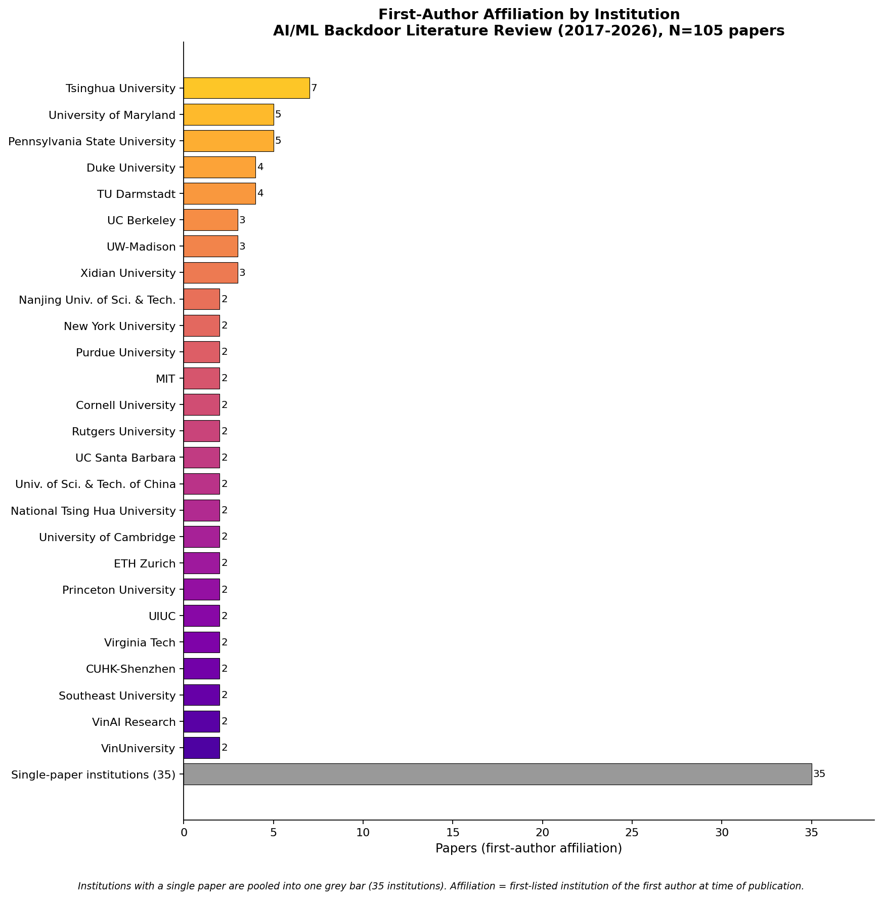

# First-Author Affiliation Analysis — AI/ML Backdoor Corpus (105 papers)

Affiliation is the **first-listed institution of the first author**, as printed on each paper at time of publication (not current affiliation, not name-based, not author residence). Two views: by **country** and by **institution**.

## Summary

- **United States: 53 papers (~50%)** and **China: 33 (~31%)** together account for **~82%** of the corpus.
- **Tsinghua University** is the single most frequent institution (7), then **Maryland** and **Penn State** (5 each).
- US strength concentrates in defenses/certified defenses; China's in attack innovation (stealthy triggers, NLP backdoors).

## Histogram 1 — by country

| Country | Papers |
|---|---|
| USA | 53 |
| China | 33 |
| Vietnam | 4 |
| Germany | 4 |
| Australia | 3 |
| Switzerland | 2 |
| United Kingdom | 2 |
| Taiwan | 2 |
| Italy | 1 |
| Hong Kong SAR | 1 |
| **Total** | **105** |

> Hong Kong SAR and Taiwan are shown separately from mainland China. Grouping both under a "Greater China" bucket would raise that combined figure to 36 and narrow the US–China gap.

## Histogram 2 — by institution

Institutions with ≥2 first-author papers (single-paper institutions pooled):

| Institution | Papers |
|---|---|
| Tsinghua University | 7 |
| University of Maryland | 5 |
| Pennsylvania State University | 5 |
| Duke University | 4 |
| TU Darmstadt | 4 |
| UC Berkeley | 3 |
| UW-Madison | 3 |
| Xidian University | 3 |
| Nanjing Univ. of Sci. & Tech. | 2 |
| New York University | 2 |
| Purdue University | 2 |
| MIT | 2 |
| Cornell University | 2 |
| Rutgers University | 2 |
| UC Santa Barbara | 2 |
| Univ. of Sci. & Tech. of China | 2 |
| National Tsing Hua University | 2 |
| University of Cambridge | 2 |
| ETH Zurich | 2 |
| Princeton University | 2 |
| UIUC | 2 |
| Virginia Tech | 2 |
| CUHK-Shenzhen | 2 |
| Southeast University | 2 |
| VinAI Research | 2 |
| VinUniversity | 2 |
| *Single-paper institutions (35)* | 35 |
| **Total** | **105** |

## Per-paper affiliation table

| # | Paper | First author | Institution | Country |
|---|---|---|---|---|
| 1 | [Backdoor Learning: A Survey](https://www.researchgate.net/publication/343006441_Backdoor_Learning_A_Survey) | Yiming Li | Tsinghua University | China |
| 2 | [Backdoor Attacks and Countermeasures on Deep Learning: A Comprehensive Review](https://arxiv.org/abs/2007.10760) | Yansong Gao | Nanjing Univ. of Sci. & Tech. | China |
| 3 | [Data Security for ML: Data Poisoning, Backdoor Attacks, and Defenses](https://arxiv.org/abs/2012.10544) | Micah Goldblum | University of Maryland | USA |
| 4 | [A Comprehensive Survey on Poisoning Attacks and Countermeasures in ML](https://dl.acm.org/doi/10.1145/3551636) | Zhiyi Tian | University of Technology Sydney | Australia |
| 5 | Backdoor Attacks and Defenses in Federated Learning: Survey, Challenges and Future Directions | Thuy Dung Nguyen | VinUniversity | Vietnam |
| 6 | [A Survey of Neural Trojan Attacks and Defenses in Deep Learning](https://arxiv.org/abs/2202.07183) | Jie Wang | University of Western Australia | Australia |
| 7 | [Threats to Pre-trained Language Models: Survey and Taxonomy](https://arxiv.org/abs/2202.06862) | Shangwei Guo | Chongqing University | China |
| 8 | Defenses in Adversarial Machine Learning: A Survey | Baoyuan Wu | CUHK-Shenzhen | China |
| 9 | [BadNets: Evaluating Backdooring Attacks on Deep Neural Networks](https://arxiv.org/abs/1708.06733) | Tianyu Gu | New York University | USA |
| 10 | [Targeted Backdoor Attacks on Deep Learning Systems Using Data Poisoning (Blended)](https://arxiv.org/abs/1712.05526) | Xinyun Chen | UC Berkeley | USA |
| 11 | [Trojaning Attack on Neural Networks](https://docs.lib.purdue.edu/cgi/viewcontent.cgi?article=2782&context=cstech) | Yingqi Liu | Purdue University | USA |
| 12 | [A New Backdoor Attack in CNNs by Training Set Corruption Without Label Poisoning (SIG)](https://arxiv.org/abs/1902.11237) | Mauro Barni | University of Siena | Italy |
| 13 | [Clean-Label Backdoor Attacks](https://arxiv.org/abs/1912.02771) | Alexander Turner | MIT | USA |
| 14 | Hidden Trigger Backdoor Attacks | Aniruddha Saha | UMBC | USA |
| 15 | [Input-Aware Dynamic Backdoor Attack](https://arxiv.org/abs/2010.08138) | Tuan Anh Nguyen | VinAI Research | Vietnam |
| 16 | [WaNet: Imperceptible Warping-based Backdoor Attack](https://openreview.net/forum?id=eEn8KTtJOx) | Tuan Anh Nguyen | VinAI Research | Vietnam |
| 17 | [Invisible Backdoor Attack with Sample-Specific Triggers (ISSBA)](https://arxiv.org/abs/2012.03816) | Yuezun Li | Ocean University of China | China |
| 18 | [Reflection Backdoor (Refool)](https://arxiv.org/abs/2007.02343) | Yunfei Liu | Beihang University | China |
| 19 | [LIRA: Learnable, Imperceptible and Robust Backdoor Attacks](https://openaccess.thecvf.com/content/ICCV2021/papers/Doan_LIRA_Learnable_Imperceptible_and_Robust_Backdoor_Attacks_ICCV_2021_paper.pdf) | Khoa Doan | Baidu Research | USA |
| 20 | [An Invisible Black-Box Backdoor Attack Through Frequency Domain (FTrojan)](https://www.ecva.net/papers/eccv_2022/papers_ECCV/papers/136730396.pdf) | Tong Wang | Nanjing University | China |
| 21 | [FIBA: Frequency-Injection Based Backdoor Attack in Medical Image Analysis](https://pure.nwpu.edu.cn/en/publications/fiba-frequency-injection-based-backdoor-attack-in-medical-image-a/) | Yu Feng | Northwestern Polytechnical University | China |
| 22 | [BppAttack: Stealthy and Efficient Trojan Attacks via Image Quantization](https://arxiv.org/abs/2205.13383) | Zhenting Wang | Rutgers University | USA |
| 23 | [DEFEAT: Deep Hidden Feature Backdoor Attacks](https://openaccess.thecvf.com/content/CVPR2022/papers/Zhao_DEFEAT_Deep_Hidden_Feature_Backdoor_Attacks_by_Imperceptible_Perturbation_and_CVPR_2022_paper.pdf) | Zhendong Zhao | Institute of Information Engineering, CAS | China |
| 24 | [Sleeper Agent: Scalable Hidden Trigger Backdoors for NNs Trained from Scratch](https://arxiv.org/abs/2106.08970) | Hossein Souri | Johns Hopkins University | USA |
| 25 | [Narcissus: A Practical Clean-Label Backdoor Attack with Limited Information](https://arxiv.org/abs/2204.05255) | Yi Zeng | Virginia Tech | USA |
| 26 | Towards Sample-specific Backdoor Attack with Clean Labels via Attribute Trigger | Mingyan Zhu | Tsinghua University | China |
| 27 | [WaveAttack: Asymmetric Frequency Obfuscation-based Backdoor Attacks](https://proceedings.neurips.cc/paper_files/paper/2024/file/4ce18228ececb78bca04cbce069891b1-Paper-Conference.pdf) | Jun Xia | East China Normal University | China |
| 28 | Physical Backdoor: Temperature-based Backdoor Attacks in the Physical World | Wen Yin | Huazhong Univ. of Sci. & Tech. | China |
| 29 | [Backdoor Attacks Against Deep Learning Systems in the Physical World](https://arxiv.org/abs/2006.14580) | Emily Wenger | University of Chicago | USA |
| 30 | How to Backdoor Federated Learning | Eugene Bagdasaryan | Cornell University | USA |
| 31 | [DBA: Distributed Backdoor Attacks Against Federated Learning](https://openreview.net/pdf/61dc789b9f12be96506a23ddb7670ac132a51d6d.pdf) | Chulin Xie | Zhejiang University | China |
| 32 | Attack of the Tails: Yes, You Really Can Backdoor Federated Learning | Hongyi Wang | UW-Madison | USA |
| 33 | Neurotoxin: Durable Backdoors in Federated Learning | Zhengming Zhang | Southeast University | China |
| 34 | A3FL: Adversarially Adaptive Backdoor Attacks to Federated Learning | Hangfan Zhang | Pennsylvania State University | USA |
| 35 | IBA: Towards Irreversible Backdoor Attacks in Federated Learning | Thuy Dung Nguyen | VinUniversity | Vietnam |
| 36 | Chameleon: Adapting to Peer Images for Planting Durable Backdoors in FL | Yanbo Dai | HKUST | Hong Kong SAR |
| 37 | FLAME: Taming Backdoors in Federated Learning | Thien Duc Nguyen | TU Darmstadt | Germany |
| 38 | DeepSight: Mitigating Backdoor Attacks in FL Through Deep Model Inspection | Phillip Rieger | TU Darmstadt | Germany |
| 39 | FLDetector: Defending FL Against Model Poisoning via Detecting Malicious Clients | Zaixi Zhang | Univ. of Sci. & Tech. of China | China |
| 40 | CrowdGuard: Federated Backdoor Detection in Federated Learning | Phillip Rieger | TU Darmstadt | Germany |
| 41 | BackdoorIndicator: Leveraging OOD Data for Proactive Backdoor Detection in FL | Songze Li | Southeast University | China |
| 42 | Distributed Backdoor Attacks on Federated Graph Learning and Certified Defenses | Yuxin Yang | Jilin University | China |
| 43 | [Instructions as Backdoors: Backdoor Vulnerabilities of Instruction Tuning for LLMs](https://arxiv.org/abs/2305.14710) | Jiashu Xu | Harvard University | USA |
| 44 | Backdooring Instruction-Tuned LLMs with Virtual Prompt Injection | Jun Yan | University of Southern California | USA |
| 45 | [Sleeper Agents: Training Deceptive LLMs that Persist Through Safety Training](https://arxiv.org/abs/2401.05566) | Evan Hubinger | Anthropic | USA |
| 46 | Universal Jailbreak Backdoors from Poisoned Human Feedback | Javier Rando | ETH Zurich | Switzerland |
| 47 | [RLHFPoison: Reward Poisoning Attack for RLHF in Large Language Models](https://arxiv.org/abs/2311.09641) | Jiongxiao Wang | UW-Madison | USA |
| 48 | Preference Poisoning Attacks on Reward Model Learning | Junlin Wu | Washington University in St. Louis | USA |
| 49 | PoisonBench: Assessing LLM Vulnerability to Data Poisoning | Tingchen Fu | Renmin University of China | China |
| 50 | [Instruction Backdoor Attacks Against Customized LLMs](https://www.usenix.org/system/files/usenixsecurity24-zhang-rui.pdf) | Rui Zhang | UESTC | China |
| 51 | Weight Poisoning Attacks on Pre-trained Models | Keita Kurita | Carnegie Mellon University | USA |
| 52 | BadNL: Backdoor Attacks Against NLP Models with Semantic-preserving Improvements | Xiaoyi Chen | Peking University | China |
| 53 | Hidden Killer: Invisible Textual Backdoor Attacks with Syntactic Trigger | Fanchao Qi | Tsinghua University | China |
| 54 | Mind the Style of Text! Backdoor Attacks Based on Text Style Transfer | Fanchao Qi | Tsinghua University | China |
| 55 | Turn the Combination Lock: Learnable Textual Backdoor Attacks via Word Substitution | Fanchao Qi | Tsinghua University | China |
| 56 | ONION: A Simple and Effective Defense Against Textual Backdoor Attacks | Fanchao Qi | Tsinghua University | China |
| 57 | Concealed Data Poisoning Attacks on NLP Models | Eric Wallace | UC Berkeley | USA |
| 58 | Hidden Trigger Backdoor Attack on NLP Models via Linguistic Style Manipulation | Xudong Pan | Fudan University | China |
| 59 | TrojanPuzzle: Covertly Poisoning Code-Suggestion Models | Hojjat Aghakhani | UC Santa Barbara | USA |
| 60 | [Planting Undetectable Backdoors in Machine Learning Models](https://arxiv.org/abs/2204.06974) | Shafi Goldwasser | UC Berkeley | USA |
| 61 | [Handcrafted Backdoors in Deep Neural Networks](https://openreview.net/forum?id=6yuil2_tn9a) | Sanghyun Hong | Oregon State University | USA |
| 62 | [Architectural Backdoors in Neural Networks](https://arxiv.org/abs/2206.07840) | Mikel Bober-Irizar | University of Cambridge | UK |
| 63 | Architectural Neural Backdoors from First Principles | Harry Langford | University of Cambridge | UK |
| 64 | [Blind Backdoors in Deep Learning Models](https://arxiv.org/abs/2005.03823) | Eugene Bagdasaryan | Cornell University | USA |
| 65 | [Can Adversarial Weight Perturbations Inject Neural Backdoors](https://arxiv.org/abs/2008.01761) | Siddhant Garg | Amazon Alexa | USA |
| 66 | BadEncoder: Backdoor Attacks to Pre-trained Encoders in Self-Supervised Learning | Jinyuan Jia | Duke University | USA |
| 67 | An Embarrassingly Simple Backdoor Attack on Self-Supervised Learning | Changjiang Li | Pennsylvania State University | USA |
| 68 | BadDiffusion: How to Backdoor Diffusion Models? | Sheng-Yen Chou | National Tsing Hua University | Taiwan |
| 69 | TrojDiff: Trojan Attacks on Diffusion Models with Diverse Targets | Weixin Chen | UIUC | USA |
| 70 | VillanDiffusion: A Unified Backdoor Attack Framework for Diffusion Models | Sheng-Yen Chou | National Tsing Hua University | Taiwan |
| 71 | Rickrolling the Artist: Injecting Backdoors into Text-Guided Generative Models | Lukas Struppek | TU Darmstadt | Germany |
| 72 | Backdoor Attacks to Graph Neural Networks | Zaixi Zhang | Univ. of Sci. & Tech. of China | China |
| 73 | Unnoticeable Backdoor Attacks on Graph Neural Networks | Enyan Dai | Pennsylvania State University | USA |
| 74 | Graph Contrastive Backdoor Attacks | Hangfan Zhang | Pennsylvania State University | USA |
| 75 | [Fine-Pruning: Defending Against Backdooring Attacks on DNNs](https://arxiv.org/abs/1805.12185) | Kang Liu | New York University | USA |
| 76 | Spectral Signatures in Backdoor Attacks | Brandon Tran | MIT | USA |
| 77 | Detecting Backdoor Attacks via Activation Clustering | Bryant Chen | IBM Research | USA |
| 78 | [Neural Cleanse: Identifying and Mitigating Backdoor Attacks in Neural Networks](https://gangw.web.illinois.edu/class/cs598/papers/sp19-poisoning-backdoor.pdf) | Bolun Wang | UC Santa Barbara | USA |
| 79 | [STRIP: A Defence Against Trojan Attacks on Deep Neural Networks](https://arxiv.org/abs/1902.06531) | Yansong Gao | Nanjing Univ. of Sci. & Tech. | China |
| 80 | ABS: Scanning Neural Networks for Back-doors by Artificial Brain Stimulation | Yingqi Liu | Purdue University | USA |
| 81 | Demon in the Variant (SCAn): Robust Backdoor Contamination Detection | Di Tang | Indiana University Bloomington | USA |
| 82 | SPECTRE: Defending Against Backdoor Attacks Using Robust Statistics | Jonathan Hayase | University of Washington | USA |
| 83 | Anti-Backdoor Learning: Training Clean Models on Poisoned Data (ABL) | Yige Li | Xidian University | China |
| 84 | [Adversarial Neuron Pruning Purifies Backdoored Deep Models (ANP)](https://arxiv.org/abs/2110.14430) | Dongxian Wu | Tsinghua University | China |
| 85 | [Neural Attention Distillation (NAD): Erasing Backdoor Triggers](https://openreview.net/forum?id=9l0K4OM-oXE) | Yige Li | Xidian University | China |
| 86 | [Adversarial Unlearning of Backdoors via Implicit Hypergradient (I-BAU)](https://arxiv.org/abs/2110.03735) | Yi Zeng | Virginia Tech | USA |
| 87 | [Few-shot Backdoor Defense Using Shapley Estimation](https://arxiv.org/abs/2112.14889) | Jiyang Guan | Institute of Automation, CAS | China |
| 88 | Reconstructive Neuron Pruning for Backdoor Defense (RNP) | Yige Li | Xidian University | China |
| 89 | The Beatrix Resurrections: Robust Backdoor Detection via Gram Matrices | Wanlun Ma | Swinburne University of Technology | Australia |
| 90 | [UNICORN: A Unified Backdoor Trigger Inversion Framework](https://openreview.net/forum?id=Mj7K4lglGyj) | Zhenting Wang | Rutgers University | USA |
| 91 | Trap and Replace: Defending Backdoor Attacks by Trapping Them into a Subnetwork | Haotao Wang | UT Austin | USA |
| 92 | Shared Adversarial Unlearning (SAU): Backdoor Mitigation | Shaokui Wei | CUHK-Shenzhen | China |
| 93 | RAB: Provable Robustness Against Backdoor Attacks | Maurice Weber | ETH Zurich | Switzerland |
| 94 | Deep Partition Aggregation (DPA): Provable Defenses against General Poisoning Attacks | Alexander Levine | University of Maryland | USA |
| 95 | Intrinsic Certified Robustness of Bagging against Data Poisoning Attacks | Jinyuan Jia | Duke University | USA |
| 96 | On Certifying Robustness against Backdoor Attacks via Randomized Smoothing | Binghui Wang | Duke University | USA |
| 97 | BagFlip: A Certified Defense against Data Poisoning | Yuhao Zhang | UW-Madison | USA |
| 98 | Run-Off Election: Improved Provable Defense against Data Poisoning Attacks | Keivan Rezaei | University of Maryland | USA |
| 99 | FCert: Certifiably Robust Few-Shot Classification in the Era of Foundation Models | Yanting Wang | Pennsylvania State University | USA |
| 100 | Improved Certified Defenses against Data Poisoning with (Deterministic) Finite Aggregation | Wenxiao Wang | University of Maryland | USA |
| 101 | Temporal Robustness against Data Poisoning | Wenxiao Wang | University of Maryland | USA |
| 102 | Certified Robustness of Nearest Neighbors against Data Poisoning and Backdoor Attacks | Jinyuan Jia | Duke University | USA |
| 103 | CRFL: Certifiably Robust Federated Learning Against Backdoor Attacks | Chulin Xie | UIUC | USA |
| 104 | PatchGuard: A Provably Robust Defense against Adversarial Patches | Chong Xiang | Princeton University | USA |
| 105 | PatchCleanser: Certifiably Robust Defense against Adversarial Patches | Chong Xiang | Princeton University | USA |

## Methodology & caveats

- **Affiliation = first-listed institution of the first author at time of publication.** Where authors listed multiple affiliations, the first-listed one is used (e.g., #42 Jilin over Illinois Tech; #65 Amazon over UW-Madison; #68/#70 National Tsing Hua over CUHK).
- **Author mobility:** some prolific first authors appear under different institutions across papers because they moved or interned (e.g., Jinyuan Jia at Duke; Chulin Xie at Zhejiang for DBA in 2020 but UIUC for CRFL in 2021). Each paper is counted by its own printed affiliation.
- **Residual institution-level uncertainty (country unaffected)** on a few entries: #33 Neurotoxin (Southeast University — best determination), #41 BackdoorIndicator (Southeast vs. HKUST-Guangzhou), #84 ANP (Tsinghua — best determination), #36 Chameleon (HKUST main vs. Guangzhou campus), #23 DEFEAT (IIE-CAS, corroborated by co-authors).
- **One correction made during research:** #69 TrojDiff (Weixin Chen) is at **UIUC (USA)**, not China; reflected in all totals (final USA 53 / China 33).
- The US lead (53 vs 33) is robust (~10 reclassifications would be needed to overturn). The "top institution" claim is more fragile: Maryland and Penn State (5) sit just behind Tsinghua (7).
