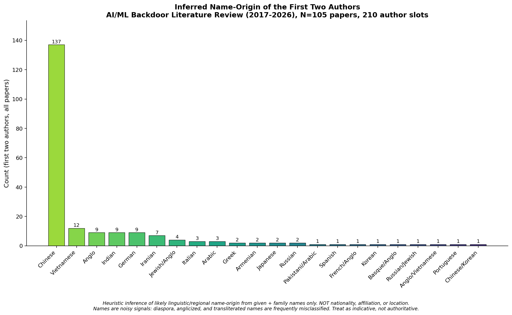
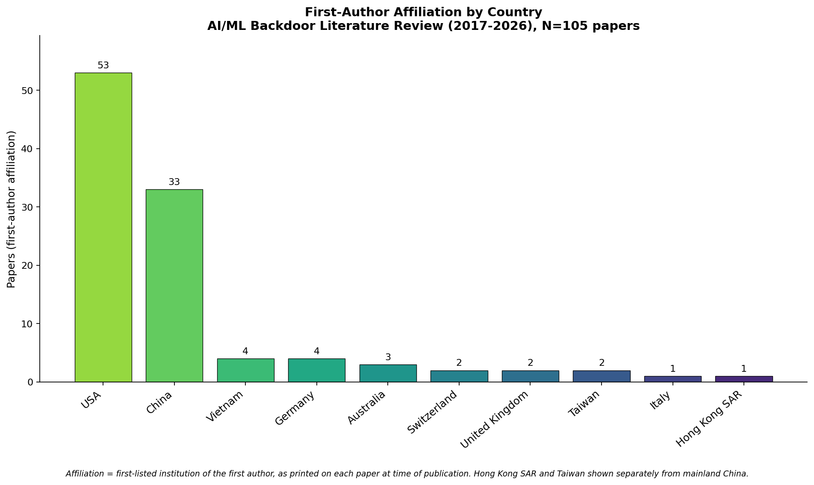

# AISec — Backdoors in AI/ML: A Literature Review (2017–2026)

A state-of-the-art survey of backdoor (neural-trojan) attacks and defenses in artificial intelligence and machine learning, covering ~105 representative papers from 2017 through early 2026, weighted toward the 2022–2026 frontier. The review spans data-poisoning/trigger attacks, federated learning, large language models, cryptographic/architectural backdoors, generative and graph models, and the full defense and certified-defense landscape.

It also includes two quantitative author-level analyses requested for this corpus: an **inferred name-origin** distribution of authors, and a **first-author affiliation** distribution (by country and by institution).

## Contents

| File | What it contains |
|---|---|
| [`01-literature-review.md`](01-literature-review.md) | The survey: taxonomy, eight thematic sections, the full annotated paper catalog with verified links, the inferred name-origin histograms, trends, open problems, and recommendations. |
| [`02-affiliation-analysis.md`](02-affiliation-analysis.md) | First-author affiliation analysis: histograms by country and institution, per-paper affiliation table, methodology, and caveats. |
| [`figures/`](figures/) | All four histogram images (PNG). |

## The four figures at a glance

**Inferred name-origin of first two authors** (210 author slots) — Chinese-origin names dominate (~65%).

**First-author affiliation by country** — the US (53) and China (33) account for ~82% of the corpus.

## How to use / cite

This is a curated, reusable reference set. Paper titles are hyperlinked **only where the URL was independently verified against a real source** (arXiv, official proceedings, publisher pages, or the maintained [THUYimingLi/backdoor-learning-resources](https://github.com/THUYimingLi/backdoor-learning-resources) list). Unlinked entries are accurate bibliographic records whose canonical URL was not verified here; the resource list above is the best place to find them. **42 of 105 papers are currently linked.**

## Important caveats

- **Name-origin inference is a heuristic over names only.** It estimates likely linguistic/regional background, **not** nationality, citizenship, ethnicity, or location. Diaspora, anglicized, and transliterated names are frequently misclassified. See the methodology section in `01-literature-review.md`.
- **Affiliation reflects the first-listed institution of the first author at time of publication**, not current affiliation; a few entries carry residual institution-level uncertainty (flagged in `02-affiliation-analysis.md`).
- The corpus is representative, not exhaustive; the field publishes hundreds of papers per year.

## License / attribution

Bibliographic metadata is factual and freely reusable. Figures are original. Please retain the caveats when redistributing the author-level analyses.
